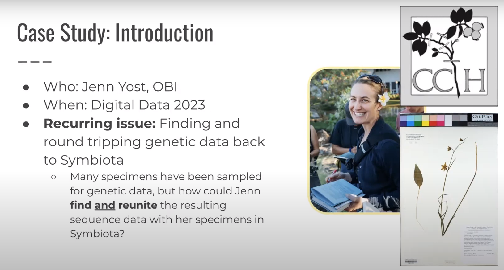

# Guiding Questions

## What do *you* do to realize the Digital Extended Specimen ^[Hardisty et al. 2022, BioScience [doi:10.1093/biosci/biac060](https://doi.org/10.1093/biosci/biac060)]?

## What would you like *others* to do to realize the Digital Extended Specimen? 

# Guiding Questions (personalized)

## What does *Jorrit* do to realize the Digital Extended Specimen?

## What would *Jorrit* like *others* to do to realize the Digital Extended Specimen? 

#  What does *Jorrit* do to realize the Digital Extended Specimen?

1. Communicate, Collaborate, and Explore
2. Remix, Reuse Existing Tools/Data
3. (Only If Absolutely Needed) Try Something New
4. Goto 1.

# Communicate, Collaborate, and Explore

## Digital Data In Biodiversity Research 2023 @ ASU

Workshop: Addressing Roadblocks and Envisioning Solutions of the Digital Extended Specimen

::: columns

:::: column

{height=50%}
{height=50%}

::::

:::: column

{height=50%}
{height=50%}
::::

:::

# Communicate, Collaborate, and Explore

# Communicate, Collaborate, and Explore

 > "[...] As a community, the most basic extended specimen is:
 > Here's the specimen and here's its sequence data. 
 > That is the link that everbody wants all the time. [...]"

— Jenn Yost 2023. [youtu.be/CNRAJvyDHu8?t=9713](https://youtu.be/CNRAJvyDHu8?t=9713)
 
# Communicate, Collaborate, and Explore

# Communicate, Collaborate, and Explore

> "[...] you're looking [...] to review your data set
>  and find all the [...] sequences known for your specimen [...] I'd say let's build it let's do it as long as you give me a
> coffee and a cookie [...]

— Jorrit Poelen 2023. [youtu.be/CNRAJvyDHu8?t=10080](https://youtu.be/CNRAJvyDHu8?t=10080)

# Communicate, Collaborate, and Explore

> "[...] you're looking [...] to review your data set
>  and find all the [...] sequences known for your specimen [...] I'd say let's build it let's do it as long as you give me a
> coffee and a cookie [...] **I'm serious.**" 

— Jorrit Poelen 2023. [youtu.be/CNRAJvyDHu8?t=10080](https://youtu.be/CNRAJvyDHu8?t=10080)

# Extending Specimen: Visualizing the "it" in "let's build it"

] records.](challenge.svg)

# Intermezzo

Dunn's ideas in his 1946 "Record Linkage" publication sure do sound a lot like ideas behind the (digital) extended specimen, don't they? ^[Dunn HL. 1946. Record Linkage. American Public Health Association. [doi:10.2105/AJPH.36.12.1412](https://doi.org/10.2105/AJPH.36.12.1412)]

 

# Trying Existing Tools

 yielded over 200k candidate records at 2023-09-19.](obi-genbank-2023-f.png) 

# OBI-GenBank Integration Workflow

# OBI-GenBank Integration Workflow Details

We found, among others, OBI associated GenBank accession **MT735455**, using my Lenovo T480s Laptop, BioKIC, and a 500Mb internet connection by ^[Poelen JH, Pearson KD, Yost J. 2023. Extending OBI Herbarium Records to include associated NCBI GenBank sequences. [https://jhpoelen.nl/obi-genbank](https://jhpoelen.nl/obi-genbank) [hash://sha256/be5605e58d2644baedcb160604080d9f02ce528064b7fbb13a5b556dd55cfeb6](https://linker.bio/hash://sha256/be5605e58d2644baedcb160604080d9f02ce528064b7fbb13a5b556dd55cfeb6)]:

1. versioning GenBank PLN ^[Poelen, Jorrit H. (2023). GenBank PLN (Plantae, Fungi, Algae) Sequence Index in TSV, CSV, JSONL formats hash://sha256/bc7368469e50020ce8ae27b9d6a9a869e0b9a2a0a9b5480c69ce6751fa4b870e hash://md5/f6f78f64e3b3ff06adc3229badbd578b (0.1) [Data set]. Zenodo. [https://doi.org/10.5281/zenodo.8117720](https://doi.org/10.5281/zenodo.8117720)]
2. streaming all ~7M GenBank PLN records
3. filter by GenBank record containing "OBI", not followed or preceded by letters
4. reviewing the ~200 resulting records
5. verify linked OBI specimen records

# Example: Herbarium Specimen **OBI09031**

The Hoover Herbarium (OBI) hosts a preserved specimen of type *Angelica hendersonii* Coult. & Rose that was collected in 1966-07-05 by Tracey & Viola Call at the north end of Tomales Bay and 2 mi south of Tomales in Marin County, California with catalog number: **OBI09031**, collector number: 2490, occurrence id: 256368e3-f8d7-4028-8010-1a4ff3eb8111, and web reference [https://cch2.org/portal/collections/individual/index.php?occid=166203](https://cch2.org/portal/collections/individual/index.php?occid=166203).

# Example: Herbarium Specimen **OBI09031**

# Example: GenBank Accession **MT735455**

GenBank hosts a accession record **MT735455** with locus `MT735455 599 bp DNA linear PLN 23-MAY-2021` and definition *Angelica hendersonii* voucher Tracey & V. Call 2490 (OBI09031) internal transcribed spacer 1, 5.8S ribosomal RNA gene, and internal transcribed spacer 2, complete sequence, and web reference [https://www.ncbi.nlm.nih.gov/nuccore/MT735455](https://www.ncbi.nlm.nih.gov/nuccore/MT735455).

# Example: GenBank Accession **MsT735455**

# Visual Inspection of OBI-GenBank Linkage

# Outcomes

::: columns

:::: column

 3. Enabled *Streaming* of GenBank Records via ASU's BioKIC ^[Biodiversity Knowledge Integration Center @ [biokic.asu.edu](https://biokic.asu.edu)]
 4. Built Prototype Workflow to Version, Filter, and Merge GenBank/DwC-A ^[[Poelen et al. 2023 jhpoelen.nl/obi-genbank](https://jhpoelen.nl/obi-genbank)]
 
::::

:::: column

 1. Associated 25 OBI Specimen With 100 GenBank Records
 2. Identified Next Collection of Interest: California Botanic Garden Herbarium (RSA)
 

::::

:::

# Rewards and Paying It Forward

::: columns

:::: column

::::

:::: column

::::

:::

# Share and Discuss

Lindsay Walker and Katie Pearson hosted a recorded SSG session organized around our experiences on linking genetic sequences ^[Symbiota Support Hub. (2023, September 11). Symbiota Support Group: Genetic Linkages with guest Jorrit Poelen. YouTube. [https://youtu.be/H76eeKxECEs](https://youtu.be/H76eeKxECEs)].

::: columns

:::: column

{height=50%}
{height=50%}

::::

:::: column

{height=50%}
{height=50%}

::::

:::

# Acknowledgement

Big thanks to Jenn Yost, Katie Pearson, Lindsay Walker, Nico Franz, Greg Post, and many others collaborators/supporters for their willingness to experiment and try things, new and old.

# Guiding Questions

##  What would *Jorrit* like *others* to do to realize the Digital Extended Specimen? 

1. Communicate, Collaborate, and Explore ^[Consider hiring specialists like Jorrit to sustain *your* work, and promote group cognition.]
2. Remix, Reuse "Boring" Open Tools with Existing Open Data ^[Save the planet: recycle biodiversity data/tools/knowledge.]
3. (Only If Absolutely Needed) Try Something New ^[Articulate *specific* needs, and find suitable collaborators.] 
4. Goto 1. ^[Keep experimenting!]

# Guiding Questions 

## What do *you* do to realize the Digital Extended Specimen?

## What would you like *others* to do to realize the Digital Extended Specimen? 

